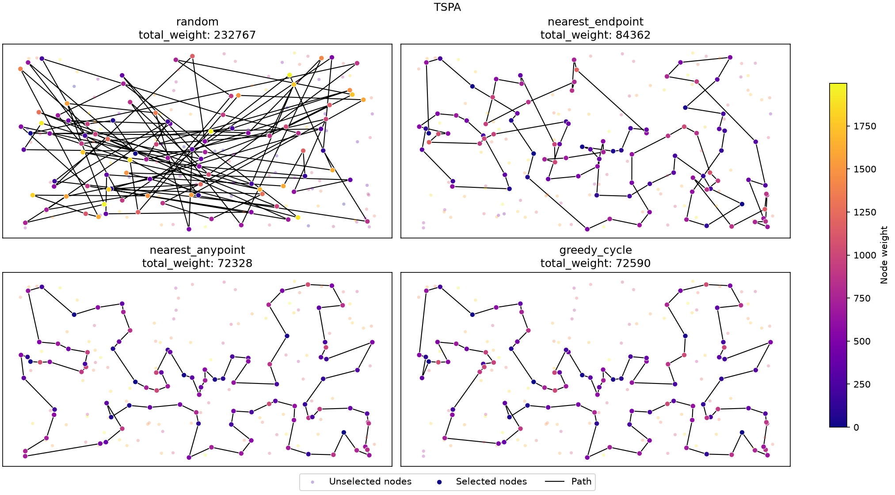
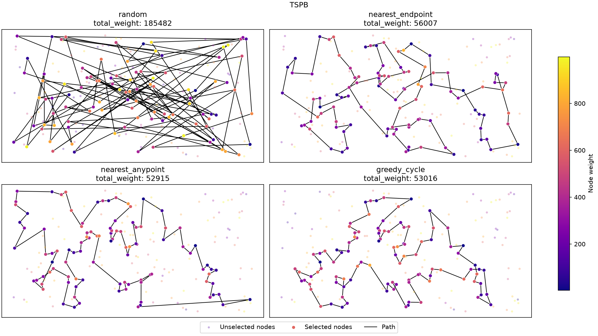

## Problem Description

We are given three columns of integers with a row for each node. The first two columns contain x and y coordinates of the node positions in a plane. The third column contains node costs. The goal is to select exactly 50% of the nodes (if the number of nodes is odd we round the number of nodes to be selected up) and form a Hamiltonian cycle (closed path) through this set of nodes such that the sum of the total length of the path plus the total cost of the selected nodes is minimized. 

The distances between nodes are calculated as Euclidean distances rounded mathematically to integer values. The distance matrix should be calculated just after reading an instance and then only the distance matrix (no nodes coordinates) should be accessed by optimization methods to allow instances defined only by distance matrices. 

More formally, we may define the problem as follows:

Let $V$ be a set of $n$ nodes, each node $j \in V$ has coordinates $(x_j, y_j)$ and a cost $c_j$. Let $d(i,j) = \text{euclidean}(x_i, y_i, x_j, y_j)$ be the distance between nodes $i$ and $j$. The task is to find a cycle $P = (p_0, p_1, \dots, p_{k-1})$, where $p_i \in V$, all $p_i$ are distinct, and $k = \lceil n/2 \rceil$, that minimizes the objective function, defined as:

$$f(P) = \sum_{i=0}^{k-1} d(p_i, p_{(i+1)}) + \sum_{i=0}^{k-1} c_{p_i}$$

where $p_{k} = p_0$.

### Instances
Both instances, TSPA and TSPB, have 200 nodes, so each solution contains 100 nodes. Coordinates are in $[0, 4000] \times [0, 2000]$ in both instances. Node costs differ: TSPA costs are in $[0, 1999]$, and TSPB costs are in $[0, 999]$.

## Algorithms

All greedy methods measure "nearest" by the change of the objective function, which includes both distance and node cost.

Notation:

- $C_{ij} = d(i,j) + c_j$ – cost matrix (distance to node $j$ plus the cost of $j$), so $f(P) = \sum_{i} C_{p_i, p_{i+1}}$;
- $s$ – start node;
- $p_{last}$ – last node of path $P$;
- $\Delta(a, j, b) = C_{aj} + C_{jb} - C_{ab}$ – increase of the objective when node $j$ is inserted between consecutive nodes $a$ and $b$.

The first and simplest method is the random solution:

```pseudocode
\begin{algorithm}
\caption{Random solution}
\begin{algorithmic}
\STATE $P \gets k$ distinct nodes of $V$ in random order
\RETURN $P$
\end{algorithmic}
\end{algorithm}
```

Next, there are three greedy methods, differing in how they add nodes to the path.

The first one just takes the nearest node to the last node of the path:

```pseudocode
\begin{algorithm}
\caption{Nearest neighbor I}
\begin{algorithmic}
\STATE $P \gets (s)$
\WHILE{$|P| < k$}
    \STATE append $\arg\min_{j \notin P} C_{p_{last}, \space j}$ to $P$
\ENDWHILE
\RETURN $P$
\end{algorithmic}
\end{algorithm}
```

The second, more sophisticated one, allows insertion of the new node at any position in the path, not just at the end:

```pseudocode
\begin{algorithm}
\caption{Nearest neighbor II}
\begin{algorithmic}
\STATE $P \gets (s)$
\WHILE{$|P| < k$}
    \FORALL{$j \notin P$}
        \STATE $\delta_j \gets \min\left(C_{p_0, \space j},\; C_{p_{last}, \space j},\; \min_i \Delta(p_{i-1}, j, p_i)\right)$ 
    \ENDFOR
    \STATE insert $j^* = \arg\min_j \delta_j$ into $P$ at its best position
\ENDWHILE
\RETURN $P$
\end{algorithmic}
\end{algorithm}
```

Finally, the greedy cycle method builds a closed cycle from the start and always inserts new nodes into the cycle at the position of minimal increase of the objective function:

```pseudocode
\begin{algorithm}
\caption{Greedy cycle}
\begin{algorithmic}
\STATE $P \gets (s, \arg\min_{j \neq s} C_{sj})$
\WHILE{$|P| < k$}
    \FORALL{$j \notin P$}
        \STATE $\delta_j \gets \min_i \Delta(p_i, j, p_{i+1})$ 
    \ENDFOR
    \STATE insert $j^* = \arg\min_j \delta_j$ into $P$ at its best position
\ENDWHILE
\RETURN $P$
\end{algorithmic}
\end{algorithm}
```

## Computational Experiment

Each greedy method was run 200 times per instance, once from each node. The random method was also run 200 times.

: Results for instance TSPA

| Method | Min | Max | Average | Time ($\mu$s) |
|---|---:|---:|---:|---:|
| Random | 232767 | 290020 | 263132.65 | **1** |
| Nearest neighbor (end) | 84362 | 90075 | 87476.63 | 42 |
| Nearest neighbor (any position) | **72328** | 77022 | 74346.96 | 653 |
| Greedy cycle | 72590 | **75281** | **73797.39** | 2076 |

: Results for instance TSPB

| Method | Min | Max | Average | Time ($\mu$s) |
|---|---:|---:|---:|---:|
| Random | 185482 | 232014 | 206682.99 | **0** |
| Nearest neighbor (end) | 56007 | **63166** | **59397.33** | 30 |
| Nearest neighbor (any position) | **52915** | 66164 | 59475.50 | 646 |
| Greedy cycle | 53016 | 63736 | 59709.47 | 2121 |

The best value in each column for each instance is in bold.

The time given is the average time of a single run of the method in microseconds, averaged over all 200 runs.

The time of 0 for the random method on TSPB is not a real value: the run was too fast to measure in microseconds. We decided to keep microseconds anyway, as using nanoseconds would make the table less readable.

<div class="newpage"></div>

## Best Solutions

In the plots, node color shows node cost, using a separate scale for each instance. Selected nodes are drawn at full size, and nodes that were not selected are faded.





<div class="newpage"></div>

Best solutions as lists of node indices (starting from 0):

**TSPA – Random (232767)**
```
180 132 100 152 16 69 61 187 3 49 191 10 15 6 121 193 93 29 189 48 143 85 98 181 65 40 182 90 77 32 92 188 96 62 115 155 194 56 134 82 138 97 162 53 157 192 19 54 74 144 114 196 66 198 129 120 87 142 59 185 116 161 158 2 30 0 81 106 140 12 13 167 168 179 117 195 52 175 127 51 28 169 151 130 145 105 71 108 160 33 46 156 8 63 55 41 4 135 123 31
```

**TSPA – Nearest neighbor, end (84362)**
```
54 9 33 36 177 67 144 53 135 58 134 176 174 106 89 107 57 182 151 93 50 3 1 164 178 29 136 186 184 47 159 130 153 78 88 193 170 146 75 64 150 42 113 43 85 142 8 131 84 158 192 181 114 141 180 132 76 80 48 31 63 149 168 97 127 187 30 123 152 108 60 116 49 11 119 160 83 90 51 16 35 87 45 140 52 179 185 28 102 156 157 71 91 38 100 4 112 139 115 5
```

**TSPA – Nearest neighbor, any position (72328)**
```
104 129 69 127 97 168 116 149 63 11 49 160 83 123 100 152 108 60 31 48 80 91 157 71 4 76 132 180 28 102 185 35 156 51 16 67 144 140 53 179 52 177 36 33 9 54 131 174 8 164 186 136 163 29 101 178 1 169 3 50 147 47 93 106 42 89 113 130 159 146 170 153 193 78 88 107 64 57 182 151 150 176 72 134 84 58 158 192 181 114 135 73 45 87 141 187 30 189 2 171
```

**TSPA – Greedy cycle (72590)**
```
31 116 149 168 63 11 49 60 108 152 100 90 123 83 160 97 127 69 171 2 189 30 187 141 87 45 73 135 114 181 192 158 58 84 134 72 176 150 151 182 57 64 107 88 78 193 153 170 146 159 130 113 89 42 106 93 47 147 50 3 169 1 178 101 29 163 136 186 164 142 8 174 131 54 9 33 36 177 52 179 53 140 144 67 16 51 156 35 185 102 28 180 132 76 4 71 157 91 80 48
```

**TSPB – Random (185482)**
```
135 93 97 33 138 192 143 82 41 67 172 109 4 161 197 182 159 49 75 62 185 86 84 46 90 111 188 61 53 125 113 5 158 132 64 189 63 107 80 52 48 24 119 9 44 81 37 129 8 57 42 38 151 130 11 10 147 187 89 166 105 131 186 88 110 199 98 145 149 142 71 0 3 20 150 168 91 115 165 73 134 122 83 116 108 154 177 1 160 106 128 30 94 54 25 155 74 183 66 173
```

**TSPB – Nearest neighbor, end (56007)**
```
32 89 57 76 54 127 129 90 153 20 14 2 110 118 56 114 196 10 148 143 78 192 162 104 185 184 3 151 69 172 133 120 96 121 198 48 72 46 86 117 160 136 8 21 154 140 47 170 125 177 6 132 29 197 175 134 45 60 40 71 155 97 115 180 65 28 149 145 158 116 147 42 50 130 30 183 38 64 85 59 167 51 87 179 82 88 171 99 67 24 34 181 152 73 98 27 135 75 79 156
```

**TSPB – Nearest neighbor, any position (52915)**
```
110 2 14 20 74 153 182 52 90 129 127 80 54 192 162 104 76 185 57 89 86 46 72 3 184 173 151 122 117 8 160 69 172 136 133 120 156 43 48 96 198 121 130 191 50 42 147 116 37 146 13 149 28 145 65 158 177 125 26 170 197 36 132 29 6 180 115 155 71 175 134 45 157 60 40 141 97 154 140 47 38 21 176 30 183 189 168 64 59 85 51 73 167 152 34 24 181 179 87 82
```

**TSPB – Greedy cycle (53016)**
```
49 64 33 40 60 71 155 141 157 45 134 175 62 36 197 29 132 178 103 6 180 115 170 177 125 26 97 140 154 47 38 21 176 30 183 191 130 63 121 198 96 48 89 156 120 133 136 172 160 69 8 117 72 46 86 184 3 173 122 151 98 111 27 135 76 185 57 104 162 54 192 127 52 182 153 20 74 2 14 90 129 80 150 84 66 67 31 24 34 152 181 88 179 87 82 73 167 51 59 85
```

## Solution Checker

Every generated solution (200 per instance and method, 1600 in total) was verified with a simple solution checker, which was created by us (see `src/utils/checker/solution_checker.hpp` in the source code). Our checker computes the objective function from the distance matrix and node costs, and compares it with the objective reported by the algorithm. It also checks that the solution has exactly $\lceil n/2 \rceil$ nodes, that every index is valid, and that no node repeats. All solutions passed.

Additionally, the checker provided on ekursy was used to verify the best solutions. It gave the same objectives as our checker and algorithms.

## Conclusions

- **All greedy methods are far better than random solutions.** On TSPA, average objectives are 74–87 thousand, compared with 263 thousand for random. A random solution pays for long edges and also picks expensive nodes, while the greedy methods choose cheap nodes (dark in the plots) and skip clusters of expensive ones.
- **Nearest neighbor that only extends the end of the path is the weakest greedy method on TSPA**, about 13 thousand worse on average than the other two. It can only extend one end, so it often gets stuck and has to jump far, and the final closing edge is not considered at all. Long crossing edges are visible in its plot.
- **Nearest neighbor with insertion at any position and greedy cycle give similar results.** Nearest neighbor with any position found the best single solution on both instances (72328 and 52915). Greedy cycle had the best average and smallest spread on TSPA. Greedy cycle always evaluates insertions into a closed cycle, so it never leaves a long closing edge for the end. Nearest neighbor with any position builds an open path, so it sometimes does: see the long edge in its TSPB plot, and its largest maximum on TSPB (66164).
- **The time-quality trade-off is clear.** Nearest neighbor with any position is about 15 times slower than nearest neighbor with end. Yet nearest neighbor with end finds worse best solutions (by a large margin on TSPA, and by a moderate margin on TSPB). The value of greedy cycle is debatable here: it is 3 times slower than nearest neighbor with any position, but it gives no clear improvement in quality on either instance. All methods, though, are fast enough to be run from every start node, so the time difference is not a problem.
- **On TSPB, the three greedy methods have almost the same averages** (59.4–59.7 thousand), and the endpoint variant is even slightly best on average and maximum. TSPB node costs are about half as large as TSPA's, so distances make up a larger part of the objective, and the advantage of considering more insertion positions is smaller.
- **The start node has a large effect.** The gap between the best and worst solution of a single greedy method is 2.7–13.2 thousand, so it is worth running greedy methods from every start node and keeping the best result.

## Source Code

[github.com/Igor-S-666/EC_Assignments](https://github.com/Igor-S-666/EC_Assignments/tree/main/src/lab_1). The algorithms are in `src/lab_1/algorithms/`, and the experiment is in `src/lab_1/main.cpp`.

For detailed structure, see the README in the source code repository.
